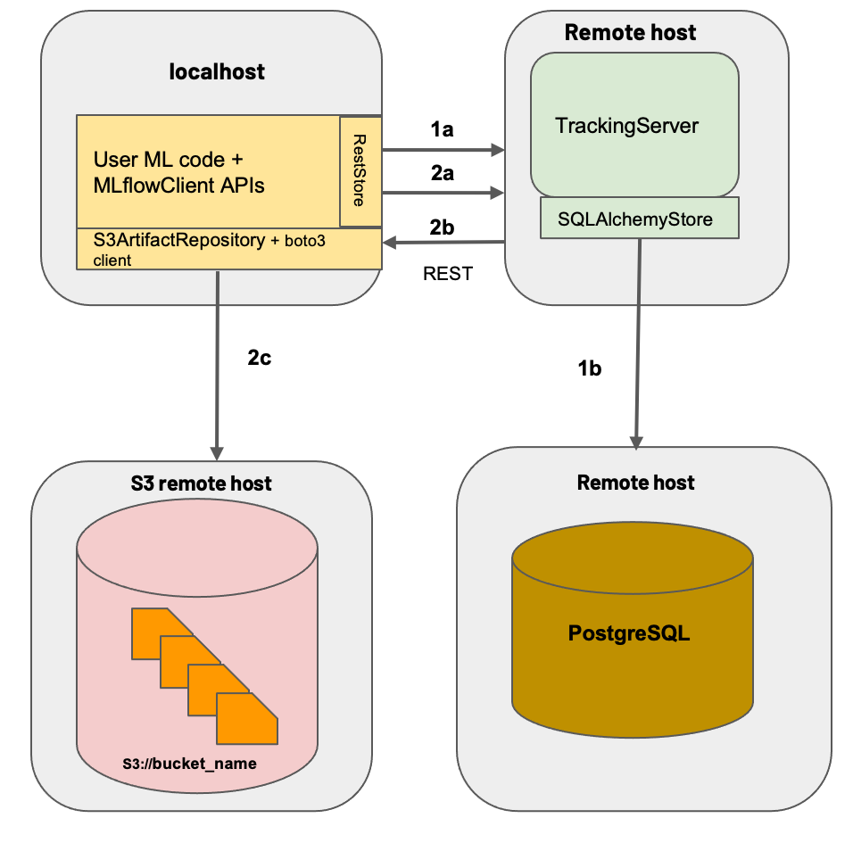

# Problem Statement:
- Data science teams frequently face challenges when it comes to effectively managing their machine learning experiments. Although Jupyter notebooks are widely used, relying on them or spreadsheets to store experiment results can become overwhelming and hinder collaboration among team members. This is especially true when dealing with multiple hyperparameters, different model architectures, evolving data sources, and numerous metrics. Such an approach compromises reproducibility and makes it difficult to compare experiments.

# Solution Using MLFlow:
- MLflow addresses these challenges by offering a unified interface and a comprehensive set of tools for managing the entire machine learning lifecycle. This includes capabilities such as experiment tracking, project packaging, model versioning, and model deployment.

# How
- Configure Mlflow on AWS, Utilizing RDS as backend store for metadata and logs.
- S3 as artifact location for storing models and artifacts.
- EC2 as Remote tracking server hosting MLFlow.
- By tracking the server remotely, Data scientists can benifit from centralized platform that allows them to access their own experiment results as well as of their team members.

# Setup:

1. Setup S3 Bucket for storing Artifacts (Keep the settings Default)
2. Launch an EC2 instance for remote tracking server:
    - Launch Instance - Generate New Key-Pair - Type (RSA, .pem) - Launch Instance
    - Visit Security Group - Edit Inbound Rules - Add Rule - Port 5000 - Choose anywhere/0.0.0.0/0 as Source - Save 
    (This will add mlflow port to the SG of the EC2 instance, allowing you to Access MLFlow UI from Any IP address)

- Note: From a security perspective, it is generally recommended to restrict access to specific IP addresses or ranges that you trust, instead of allowing open access to all IP addresses. This would help mitigate potential security risks and unauthorized access. Examples of trusted IP addresses or ranges could include an office network or a VPN.

    - Create IAM role to grant necessary permissions to Instance - IAM - Create role - AWS Service - EC2 - AmazonS3FullAccess - AmazonRDSFullAccess - Create role
    - Visit EC2 Dashboard - Actions - Security - Modify IAM Role - Select the IAM Role - Update 
    (This will enable direct interaction with various AWS services and resources from the EC2 instance, eliminating the need to provide credentials repeatedly)

3. Setup AWS RDS with PostGreSQL For MLFLow backend store:
    - Visit RDS - Create Database - PostgreSQL - Choose FreeTier - Settings - Specify the Master username and password(make sure you remember in order to configure later) - Additional configurations - Specify a Database name - Create Database 
    - Once RDS is created - Click on the Database - Connectivity and Security - VPC - SG - Edit Inbound Rules - Add Rule - PostgreSQL(type) - Select the SG of EC2 - Save Rules
    ( This will add the PostgreSQL port (5432) to the security group of the RDS instance. By doing this, we ensure that incoming connections on that port are allowed, enabling the connection between the RDS instance and the MLflow tracking server.)

4. Install MLflow and start the remote tracking server:
    - EC2 Instance - EC2 instance Connect - Browser based SSH connection in the console providing secure access to EC2.
    `(sudo yum -y install python-pip )`
    `(pip3 install mlflow boto3 psycopg2-binary)`

    - start the Mlflow Server:
        `(mlflow server -h 0.0.0.0 -p 5000 --backend-store-uri postgresql://DB_USERNAME:DB_PASSWORD@DB_ENDPOINT:5432/DB_NAME --default-artifact-root s3://S3_bucket_name)`
    ( One can find the DB_ENDPOINNT in Connectivity & security section of RDS)

5. Access MLflow Remote tracking server UI:
    - Copy the Public IPv4 DNS from the EC2 instance - Paste in the URL and Append :5000 (Mlflow UI Server)

6. Configure your ML code :
	- Check `(main.py)`

- Through this setup, any team member can conveniently access the MLflow server from their own system and contribute experiments to the centralized platform. Such a setup promotes seamless collaboration, efficient organization, and effective tracking of experiments within the data science team.